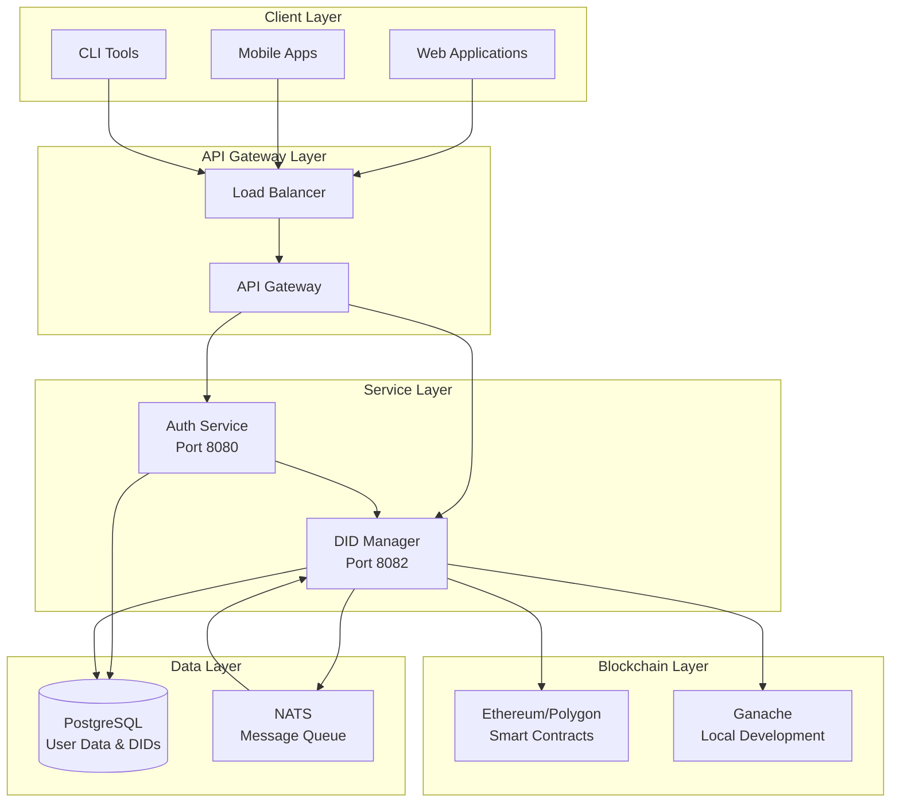
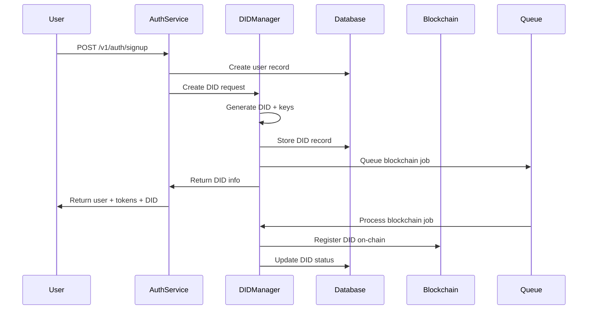
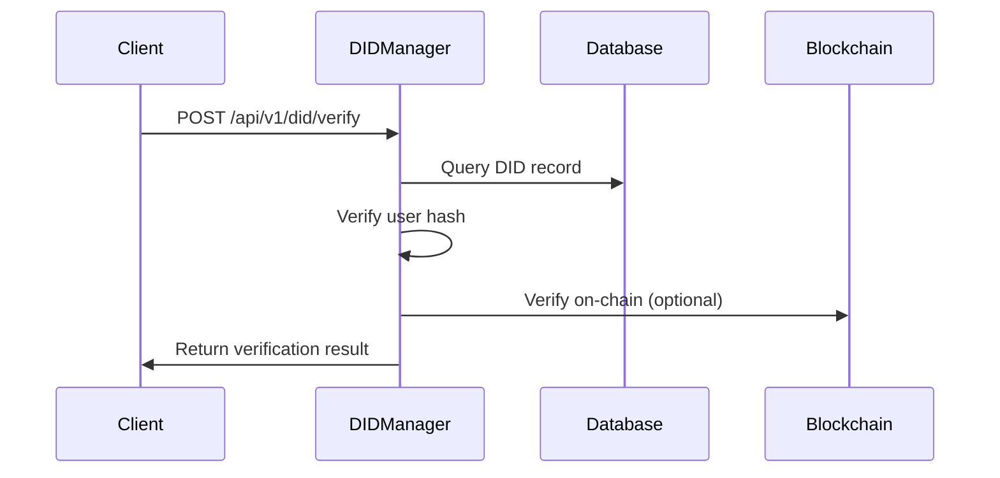
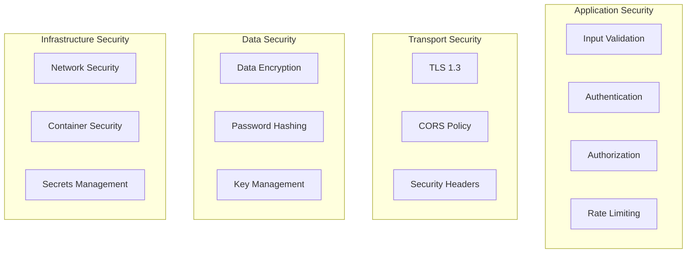
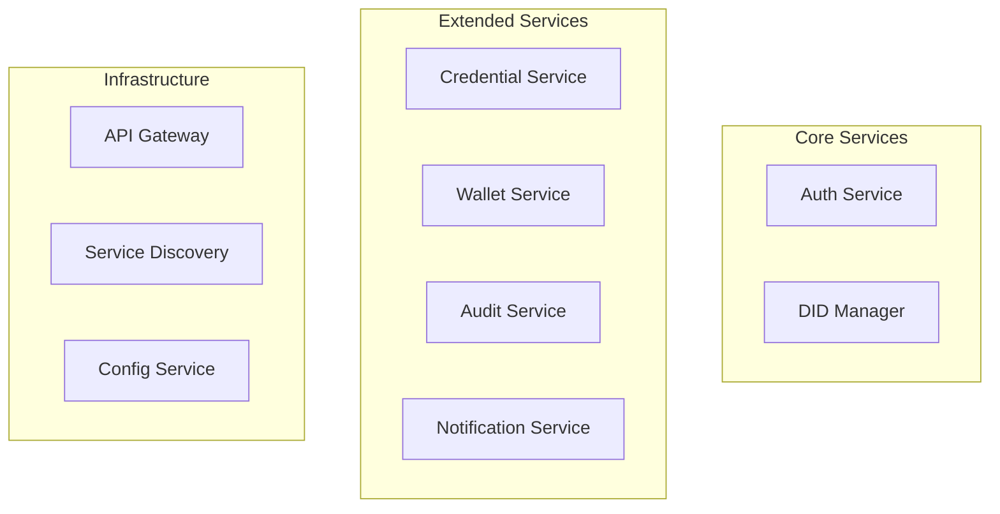

# System Architecture

## Overview

The Decentralized Identity & Authentication System is built using a microservices architecture that combines traditional web services with blockchain technology to provide secure, verifiable digital identities.

## High-Level Architecture



## Component Details

### 1. Auth Service

**Purpose:** Traditional user authentication with DID integration

**Technologies:**
- Go 1.21+
- gRPC + REST Gateway
- PostgreSQL
- JWT tokens

**Responsibilities:**
- User registration and authentication
- JWT token management
- Password hashing and validation
- Integration with DID Manager for identity creation

**API Endpoints:**
```
POST /v1/auth/signup    - Register user + create DID
POST /v1/auth/signin    - Authenticate user
POST /v1/auth/refresh   - Refresh JWT token
POST /v1/auth/signout   - Sign out user
```

### 2. DID Manager

**Purpose:** Decentralized identity creation and management

**Technologies:**
- Go 1.21+ with Gin framework
- PostgreSQL for DID storage
- NATS for async job processing
- Ethereum client libraries

**Responsibilities:**
- DID generation using Ed25519 cryptography
- User identity hashing (SHA256)
- Blockchain interaction for immutable storage
- Asynchronous job processing
- DID verification and status tracking

**API Endpoints:**
```
POST /api/v1/did           - Create new DID
POST /api/v1/did/verify    - Verify DID
GET  /api/v1/did/status/{did} - Get DID status
GET  /api/v1/did/user/{id} - Get DID by user ID
POST /api/v1/queue/process - Process blockchain queue
GET  /api/v1/health        - Health check
```

### 3. Smart Contracts

**Purpose:** Immutable DID registry on blockchain

**Technology:** Solidity 0.8.19 with OpenZeppelin

**Main Contract: DIDRegistry.sol**
```solidity
contract DIDRegistry {
    struct DIDRecord {
        string did;
        uint256 registrationTime;
        uint256 lastUpdateTime;
        bool isActive;
        bool isRevoked;
        string metadata;
    }
    
    mapping(bytes32 => DIDRecord) public didRecords;
    mapping(string => bytes32) public didToUserHash;
    
    function registerDID(bytes32 userHash, string calldata did, string calldata metadata) external;
    function updateDID(bytes32 userHash, string calldata newDid, string calldata metadata) external;
    function verifyDID(string calldata did) external view returns (bool);
    function revokeDID(bytes32 userHash) external;
}
```

### 4. Database Schema

**PostgreSQL Tables:**

```sql
-- Users table (Auth Service)
CREATE TABLE users (
    id UUID PRIMARY KEY DEFAULT gen_random_uuid(),
    name VARCHAR(255) NOT NULL,
    email VARCHAR(255) UNIQUE NOT NULL,
    password_hash VARCHAR(255) NOT NULL,
    did VARCHAR(255),
    user_hash VARCHAR(255),
    created_at TIMESTAMP DEFAULT CURRENT_TIMESTAMP,
    updated_at TIMESTAMP DEFAULT CURRENT_TIMESTAMP
);

-- DIDs table (DID Manager)
CREATE TABLE dids (
    id UUID PRIMARY KEY DEFAULT gen_random_uuid(),
    user_id UUID NOT NULL,
    did VARCHAR(255) UNIQUE NOT NULL,
    user_hash VARCHAR(255) NOT NULL,
    public_key TEXT NOT NULL,
    status VARCHAR(50) DEFAULT 'pending',
    created_at TIMESTAMP DEFAULT CURRENT_TIMESTAMP,
    updated_at TIMESTAMP DEFAULT CURRENT_TIMESTAMP,
    blockchain_tx VARCHAR(255)
);

-- Blockchain jobs table
CREATE TABLE blockchain_jobs (
    id UUID PRIMARY KEY DEFAULT gen_random_uuid(),
    job_type VARCHAR(50) NOT NULL,
    did_id UUID REFERENCES dids(id),
    payload JSONB NOT NULL,
    status VARCHAR(50) DEFAULT 'pending',
    retry_count INTEGER DEFAULT 0,
    created_at TIMESTAMP DEFAULT CURRENT_TIMESTAMP,
    updated_at TIMESTAMP DEFAULT CURRENT_TIMESTAMP,
    processed_at TIMESTAMP
);
```

## Data Flow Diagrams

### User Registration Flow



### DID Verification Flow



## Security Architecture

### Cryptographic Components

1. **Ed25519 Key Pairs**
   - Used for DID generation
   - Public key stored in database
   - Private key never stored

2. **SHA256 Hashing**
   - User identity data hashing
   - Consistent hash generation
   - Privacy preservation

3. **JWT Tokens**
   - HS256 algorithm
   - Access token (15 min expiry)
   - Refresh token (7 day expiry)

### Security Layers



## Scalability Considerations

### Horizontal Scaling

1. **Stateless Services**
   - Auth Service and DID Manager are stateless
   - Can scale horizontally behind load balancer

2. **Database Scaling**
   - Read replicas for DID verification
   - Sharding by user ID hash

3. **Blockchain Scaling**
   - Multiple blockchain nodes
   - Batch DID registrations
   - Layer 2 solutions (Polygon)

### Performance Optimizations

1. **Caching Strategy**
   ```
   Redis Cache:
   - DID verification results (TTL: 1 hour)
   - User authentication tokens
   - Blockchain transaction status
   ```

2. **Database Optimization**
   ```sql
   -- Indexes for performance
   CREATE INDEX idx_dids_user_id ON dids(user_id);
   CREATE INDEX idx_dids_did ON dids(did);
   CREATE INDEX idx_dids_status ON dids(status);
   CREATE INDEX idx_blockchain_jobs_status ON blockchain_jobs(status);
   ```

3. **Async Processing**
   - NATS queue for blockchain operations
   - Background workers for heavy processing
   - Event-driven architecture

## Deployment Architecture

### Development Environment

```yaml
# docker-compose.yml
services:
  auth-service:
    build: ./services/auth-service
    ports: ["8080:8080"]
    environment:
      - DID_MANAGER_URL=http://did-manager:8082
      
  did-manager:
    build: ./services/did-manager
    ports: ["8082:8082"]
    environment:
      - ETHEREUM_RPC_URL=http://ganache:8545
      
  postgres:
    image: postgres:15-alpine
    ports: ["5432:5432"]
    
  nats:
    image: nats:2.9-alpine
    ports: ["4222:4222"]
    
  ganache:
    image: trufflesuite/ganache-cli
    ports: ["8545:8545"]
```

### Production Environment

```yaml
# Kubernetes deployment
apiVersion: apps/v1
kind: Deployment
metadata:
  name: did-manager
spec:
  replicas: 3
  selector:
    matchLabels:
      app: did-manager
  template:
    spec:
      containers:
      - name: did-manager
        image: did-manager:v1.0.0
        ports:
        - containerPort: 8082
        env:
        - name: DB_HOST
          valueFrom:
            secretKeyRef:
              name: db-secret
              key: host
        resources:
          requests:
            memory: "256Mi"
            cpu: "250m"
          limits:
            memory: "512Mi"
            cpu: "500m"
```

## Monitoring & Observability

### Metrics Collection

```go
// Prometheus metrics
var (
    didCreationTotal = prometheus.NewCounterVec(
        prometheus.CounterOpts{
            Name: "did_creation_total",
            Help: "Total number of DIDs created",
        },
        []string{"status"},
    )
    
    blockchainOpsDuration = prometheus.NewHistogramVec(
        prometheus.HistogramOpts{
            Name: "blockchain_ops_duration_seconds",
            Help: "Time spent on blockchain operations",
        },
        []string{"operation"},
    )
)
```

### Logging Strategy

```go
// Structured logging with zerolog
logger := zerolog.New(os.Stdout).With().
    Timestamp().
    Str("service", "did-manager").
    Str("version", "1.0.0").
    Logger()

logger.Info().
    Str("did", didRecord.DID).
    Str("user_id", didRecord.UserID).
    Str("correlation_id", correlationID).
    Msg("DID created successfully")
```

### Health Checks

```go
// Health check endpoints
func (h *DIDHandler) HealthCheck(c *gin.Context) {
    health := map[string]interface{}{
        "status": "healthy",
        "service": "did-manager",
        "timestamp": time.Now(),
        "dependencies": map[string]string{
            "database": h.checkDatabase(),
            "blockchain": h.checkBlockchain(),
            "queue": h.checkQueue(),
        },
    }
    
    c.JSON(http.StatusOK, health)
}
```

## Error Handling & Recovery

### Error Categories

1. **Validation Errors** (400)
   - Invalid input data
   - Malformed DIDs
   - Missing required fields

2. **Authentication Errors** (401/403)
   - Invalid JWT tokens
   - Unauthorized access
   - Expired credentials

3. **Resource Errors** (404/409)
   - DID not found
   - Duplicate DID creation
   - User already exists

4. **System Errors** (500)
   - Database connection failures
   - Blockchain node unavailable
   - Internal service errors

### Recovery Strategies

1. **Retry Logic**
   ```go
   func (s *DIDService) retryBlockchainOperation(operation func() error) error {
       for i := 0; i < maxRetries; i++ {
           if err := operation(); err == nil {
               return nil
           }
           time.Sleep(time.Duration(i) * time.Second)
       }
       return fmt.Errorf("operation failed after %d retries", maxRetries)
   }
   ```

2. **Circuit Breaker**
   ```go
   type CircuitBreaker struct {
       threshold int
       timeout   time.Duration
       state     State
   }
   
   func (cb *CircuitBreaker) Call(operation func() error) error {
       if cb.state == Open {
           return ErrCircuitOpen
       }
       // Execute operation with circuit breaker logic
   }
   ```

3. **Graceful Degradation**
   - Local DID verification when blockchain unavailable
   - Cached responses for common queries
   - Offline mode for critical operations

## Future Architecture Enhancements

### Multi-Chain Support

```go
type BlockchainRegistry interface {
    RegisterDID(chain string, did *DID) error
    VerifyDID(chain string, did string) (*VerificationResult, error)
    GetSupportedChains() []string
}

type MultiChainManager struct {
    ethereum *EthereumClient
    polygon  *PolygonClient
    solana   *SolanaClient
}
```

### Microservice Expansion



This architecture provides a solid foundation for a scalable, secure decentralized identity system that can grow and adapt to future requirements.
